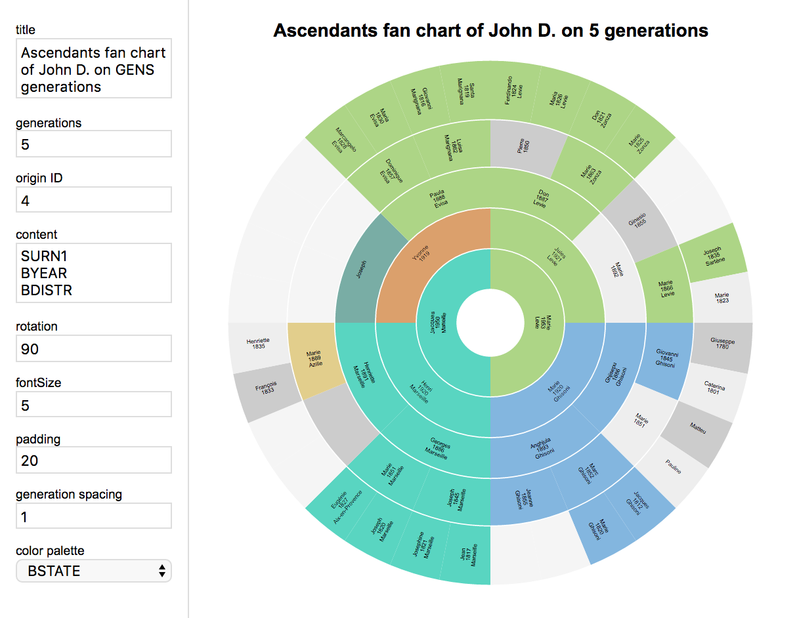

# gedcom-svg-fanchart

Create a SVG genealogical fan chart from a GEDCOM file.

[1]: https://rawgit.com/nliautaud/gedcom-svg-fanchart/master/index.html
[2]: https://github.com/nliautaud/gedcom-svg-fanchart/archive/master.zip

[Demo][1]|
----------
[][1]|

## Usage

[Download][2] the repository and open it with your web browser, or go to the [live version][1].

Drop a GEDCOM file onto the page.

## Saving & printing

You can print the chart (to a real printer, to PDF...) using the *print* option of your modern web browser.

You can save the page with its content by using the *File > Save web page as...* option of your web browser, usually with the shortcut ``Cmd+S``. The saved page will be a working version of the software and will contain the given GEDCOM data.

The original file is accessing libraries listed below trough internet. If you need a local version, you can simply save it *without* dropping a GEDCOM file. The saved file, accompanied with its data folder, will be a clean, local version of the software. Note that the data folder name is browser-specific.

## Settings

The chart is automaticaly updated when editing the following parameters.

- **title** : dynamic text template for the chart title.
- **content** : dynamic text template for the chart labels.
- **generations** : number of ancestors generations to show in the chart.
- **origin ID** : number of the GEDCOM individual to use as center of the chart.
- **rotation** : label are drawn in the most readable orientation according to the slice size and chart rotation.
- **font size** : slices sizes and labels are adjusted accoding to the content size.
- **padding** : space surrounding labels.
- **generation spacing** : space between generation circles.
- **color palette** : colorize the chart according to a specific data.

## Dynamic text templates

The chart title and slices labels use text templates, where keywords in uppercase are dynamicaly replaced by corresponding values.

Any GEDCOM tag will be replaced by its corresponding data field, for example :

```
SEX			M
OCCU		Astronaut
```

The following keywords will be replaced too (and each birth `B` have a variant for death `D`) :

```
LASTN		Doe
SURNM   	John Alexander
BYEAR       1930
BPLAC		Lorentz Crater, Northwest limb, Bright side, Moon
BCNTR		Moon
BSTAT		Bright side
BDSTR		Northwest limb
BTOWN		Lorentz Crater
BSOUR		NASA Bigest book, p14
BSQUA		3 (birth source quality)
ASQUA		7 (all sources quality)
```

Values can be truncated by using numbers and dots :

```
SURN          John Alexander
SURN1         John
SURN.1        John A.
SURN..1       John...
SURN...1      J...
```

## Editing

The chart style is extensively editable with CSS, as every slice is populated with useful CSS classes of form ``.TAGNAME_tagvalue``. Each line of text is displayed as a separate ``<text>`` element, with the different pieces of information surrounded by ``<tspan>``.

```
<g class="slice GEN_5 SEX_f OCCU_astronaut SOUR_s0019 SOUR_s0032 NOTE_n0132 LAST_doe SURN_john SURN_alexander">
	<path></path>
	<text><tspan>John A.</tspan><tspan> </tspan><tspan>Doe</tspan></text>
	<text><tspan>Asronaut</tspan></text>
</g>
```

The dynamic coloring for example is done by attributing a distinct fill color to every class of a tag type, preceded by a trigger class :
```
.show_SURN .SURN_john path {fill: red}
.show_SURN .SURN_paul path {fill: green}
.show_OCCU .OCCU_astronaut path {fill: skyblue}
```

## External libraries

- GEDCOM parser : https://github.com/tmcw/parse-gedcom
- SVG drawing : https://github.com/adobe-webplatform/Snap.svg
- SVG pan and zoom : https://github.com/ariutta/svg-pan-zoom
- Textarea resizing : https://github.com/jackmoore/autosize
- Colors palettes generation : https://github.com/medialab/iwanthue

## Tests

Tested with GEDCOM files exported from Gramps (https://gramps-project.org).

Tested on desktop with latest chrome, firefox & safari.
